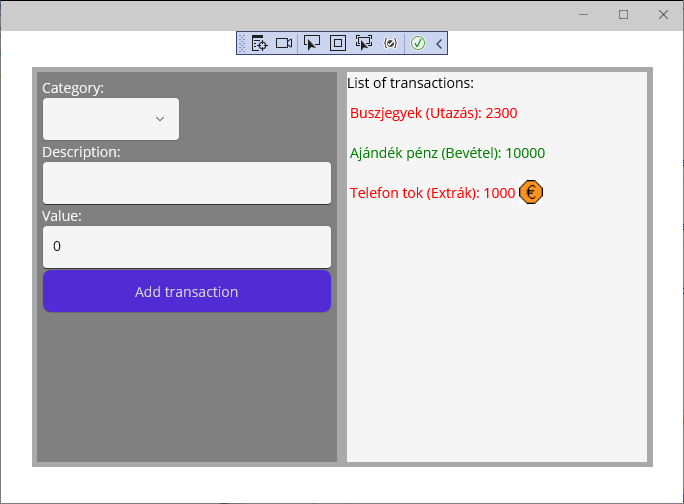

# DataBinding Labor

Felkészülési anyagok:

- A mérés előtt nézd meg a Moodle alatti bevezető anyagokat.
- A labor során szóba kerül a view model. Ez a később tanult MVVM architektúra egyik eleme. Lényege, hogy az adatmodellhez (például emberek egy listája) van egy view model (egy külön osztály) is, ami a propertyjeinek az értékét a modelből veszi, de olyan formában, ahogy azt a nézet (view) közvetlenül meg tudja jeleníteni. Például ha a modelben van keresztnév és vezetéknév, a felhasználó felületen viszont egyben, névként jelenik majd meg, akkor a view modelnek lesz egy Name nevű propertyje, amit ha lekérdezek, a getterje a modelből elkéri a vezeték- és keresztnevet és összefűzve visszaadja őket. Így a nézet és a view model között könnyen lehet adatkötés, mivel a megjelenítendő adatok összeválogatását a view model megoldja, a view és view model közötti adatkötés a legtöbb esetben már csak átmásolgat értékeket.

# DataBindingLab mérési feladatok

(A labor elején, már most hozz létre egy új branchet és utána azon dolgozz, hogy a pull requestet könnyű legyen majd a labor végén létrehozni! És ha az egyetemen kezdted el a munkát, mielőtt elmész, ne felejtsd el felpusholni a változásokat a laborgépről a githubra!)

A mérés során az alábbi feladatokat kell elkészíteni. Legalább minden feladat után commitolj.

A feladatokat a NewTransaction és SummaryList user controlokban kell elkészíteni. Nézd meg a MainPage.xaml fájlt, itt látszik, hogy az egész felhasználói felület ebből a két user controlból áll, melyeket egy HorizontalStackLayout egymás mellé fog helyezni.

A megoldás így fog kinézni:

## Új tranzakció (NewTransaction) felvételének implementálása

A keretprogram már tartalmazza a felhasználói felület azon részét, mely új tranzakciókat hoz létre. Ami hiányzik, az az adatkötés és a nyomógomb eseménykezelője.

- A Picker feladata, hogy a code behindban (NewTransaction.xaml.cs) található Categories lista tartalmát megjelenítse (ItemsSource propertyhez adatkötés), és az aktuálisan kiválasztott elem sorszámát (SelectedIndex property) a NewTransaction.SelectedCategoryIndex propertybe is írja be. Ez utóbbihoz kétirányú adatkötés kell, mivel a UI nem csak megjelenít, hanem vissza is ír adatokat. Mivel a SelectedIndex propertyre az alapértelmezett adatkötési mód a TwoWay, azt külön nem kell megadni.
- Ezen kívül a Description és Value feliratok utáni TextBoxok is a NewTransaction megfelelő propertyjeibe írják be a felhasználó által megadott értékeket.

Ezzel elértük, hogy a nyomógomb megnyomásakor az eseménykezelőnek nem kell a ListBox és TextBox controloktól elkérni a megadott adatokat, hanem azok már a NewTransaction megfelelő propertyjeibe be vannak másolva.

Most következik a Button_Click eseménykezelő implementálása. Itt létre kell hozni egy új DataBindingLab.Model.Transaction példányt, kitölteni a propertyjeit és felvenni a NewTransaction.Transactions listára.

Ha ez készen van, akkor a programot futtatva ha kitöltjük a mezőket és megnyomjuk a nyomógombot, egy új tranzakció felkerül a listára.
Ellenőrizd le, hogy az eseménykezelő végén ha lekéred a transactions lista értékét a debuggerrel, akkor tényleg benne vannak-e az addig felvett elemek!

## Tranzakciók listájának megjelenítése (SummaryList)

Jelenleg a tranzakciók listája üres. Ehelyett a "List of transactions" felirat alá egy CollectionView kell, aminek az ItemSource-a a SummaryList.List. Ha megnézed a code behind-ot, ez a lista a View Modelje egy TransactionList-nek, ez pedig ugyanaz a típus, mint amiben a NewTransaction is tárolja a tranzakcióit. A SummaryListViewModel feladata, hogy figyelje a hátterében lévő (modell oldali) TransactionList-et és ha felkerül rá egy új Transaction, akkor a view model listájára is felkerül egy az új Transaction-höz tartozó SummaryListItemViewModel. A SummaryListItemViewModel olyan propertyket tartalmaz, amiket majd a tranzakciók listájában már közvetlenül meg tudunk jeleníteni, mint például a megjelenítési szín kiválasztásához használt SummaryListItemViewModel.IsExpense, ami ilyen formában a Transaction osztályban nem szerepel. (Ezért lesz a Transaction-höz tartozó view model a SummaryListItemViewModel, mivel az már a közvetlenül megjelenítésre szánt adatokat tartalmazza.)

A SummaryList.xaml ezért kell, hogy tartalmazzon egy CollectionView-t, benne egy CollectionView.ItemTemplate-tel, ami megadja, hogy hogyan néz ki a lista egy eleme. Ezen belül lesz egy DataTemplate, ami megmondja a xaml környezetnek, hogy a következőkben amit megjelenítünk, az egy SummaryListItemViewModel típusú elem lesz (x:DataType property).

A DataTemplate elemen belül kell leírnunk, hogy hogyan néz ki egy listaelem. Ehhez kell egy HorizontalStackLayout, ami egymás mellé rendezi majd a benne lévő elemeket. Első körben rakjunk bele egy Label-t, aminek a szövege a SummaryListItemViewModel.Summary. Itt egy irányú adatkötés elég lesz, mivel a UI nem módosít rajtuk. (Mivel az adatkötés egy SummaryListItemViewModel elemhez kapcsolódik, ezért az adatkötésnél már csak ezen belül kell megadni, hogy mihez szeretnénk adatkötni, jelen esetben a Summary-hez.)

Ha ezzel készen vagyunk és elindítjuk az alkalmazást, akkor ha felveszünk egy új tranzakciót, az megjelenik a listán.

## Tranzakciók listájának megjelenítése (SummaryList) II.

Most szépítsük ki egy kicsit a tranzakciók listáját.

- A Summary betűszínét (Label.TextColor) kössük hozzá a SummaryListItemViewModel.IsExpense-hez, hogy negatív szám estén más színt használhassunk. Mivel az adat bool, nekünk viszont szín kell, így használjuk a a IsExpenseConverter-t, ami a SummaryList erőforrásai között (ContentView.Resources) már szerepel, vagyis ott már van egy példány belőle. IsExpense2ColorConverter a típusa (előtte a "vm" a kicsit fentebbi xmlns:vm="using:DataBindingLab.ViewModel" sor miatt a view model névterünkre utal). Röviden tehát a betűszínnél adjuk meg a Binding-nak, hogy használja Converternek a IsExpenseConverter néven elérhető statikus erőforrást.

Nézd meg a konverter forráskódját! A kapott bool értéktől függően két konstans (Colors.Red és Colors.Green) az egyiket adja mindig vissza.
Ellenőrizd a felhasználói felületen, hogy pozitív és negatív "Value" érték mellett a tranzakciók tényleg zölden vagy pirosan jelennek meg!

- Végül vegyél fel a HorizontalStackLayout-ba egy Image típusú vezérlőt is. Ennek forrása (Source) a "View/luxury.png" legyen. Azt szeretnénk, hogy a SummaryListItemViewModel.IsLuxury propertytől függjön, hogy látható-e, vagyis az Image.Visibility ehhez legyen hozzákötve.

## Value és Description mezők nullázza

Miután felvettünk egy új tranzakciót, szerencsés lenne, ha a Description és Value mezők törlődnének és nem kézzel kellene az előző értéket kitörölni. Ehhez a nyomógomb eseménykezelőjében a NewTransaction.Description és Value propertyket nullázd ki.

Próbáld ki az alkalmazást! Ha két tranzakciót felveszel úgy, hogy az elsőnek megadod az értékeit, majd kétszer kattintassz a nyomógombra, akkor egy érdekes hibát látsz: a felhasználói felületen nem törlődtek a beviteli mezők, de a második tranzakciónak már üres a Description-je és 0 a Value-ja.
Ennek oka, hogy bár a NewTransaction két adatkötött propertyje nullázódott, erről senki nem szólt a felhasználói felületnek: az adatkötés ott van, de az arra vár, hogy a NewTransaction ilyenkor szóljon egy OnPropertyChanged esemény formájában. Ehhez a NewTransaction osztálynak implementálnia kell az INotifyPropertyChanged interfészt és a nyomógomb eseménykezelőjének végén, miután kinulláztuk az értékeket, el kell lőnie az OnPropertyChanged eseményt mind a két propertyre vonatkozóan (vagyis kétszer).

## További feladatok

A laborfeladat funkciói ezzel készen vannak. A maradék időben szépítsd ki egy kicsit az alkalmazást! Nézd meg, az egyes felhasználói felület elemeknek milyen beállításai vannak még. Például igazíthatsz a háttérszíneken és az elrendezésen.
